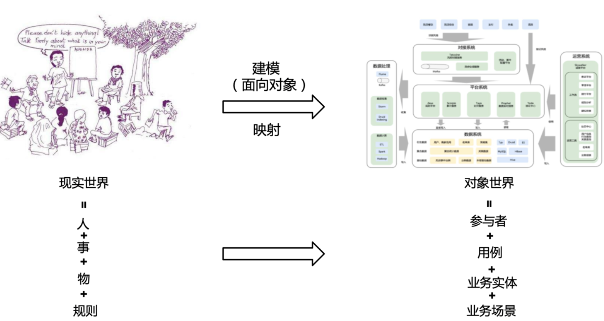

# 通过用例描述现实需求

关于什么是建模，建模的本质是什么，我在上篇文章中已介绍。那么接下来我们应该如何去做呢？其实市面上关于建模方法主要分为两类：领域驱动设计（DDD）和用例驱动设计（UDD）。领域驱动设计主要强调的是先有对业务极其了解的领域专家，带领团队从业务领域里找出反映业务本质的那些事物、规则和结构，将其抽象化，描述业务运行的基本原理和业务交互机制。然后，再通过普遍的原理和机制去实现具体的业务过程，强调从根本上解决问题。用例驱动设计里没有领域专家这一说，强调的是原点出发，了解涉众的真实需求，以实现一个个用例场景为目的，通过用例场景的分析得出我们的系统模型，具有较强的实用主义。

条条大路通罗马，不论采用何种方法，最后的目的都是一致的，只是看问题的角度不一样罢了。我喜欢把这两类设计理念比喻成《笑傲江湖》里面华山派的气宗和剑宗。领域驱动设计相当于气宗，一开始稳扎稳打，入门门槛较高，短期内很难看到效果，尤其是对于工作不久的同学来说，看一遍还整不太明白。用例驱动设计，讲究凡事从需求原点出发，见招拆招，立足当下，入门门槛较低，上手容易，短期内能看到效果。当然我们练功不走极端，练到最后都是剑气合一的高手。

回顾近些年出现的一些互联网软件产品，比如直播，打车，网络带货等，其实都是随着社会的进步产生的一些新事物，大家都是在摸着石头过河，没人敢说自己是这个领域的专家，那么在这样的背景下我们如何着手去分析和设计我们的系统呢，这就体现出用例驱动设计的优越性了。所以，本篇文章主要从用例驱动的角度来介绍用例在业务建模中的应用。

业务建模本身主要由业务知识和建模方法两个方面构成。其中业务知识主要来源于业务方提供的需求文档。在需求分析阶段我们主要是了解业务知识，主要关注业务问题、方案和目标这三个点。所谓业务问题则表示这个需求是为了解决什么问题，比如满足用户/客户XX需求，提升日活，提高留存或者提高转化率等；方案则是为了解决问题而输出的产品策略；目标则是一系列量化指标，用来评估和检验我们方案的有效性。

作为研发人员一定要仔细阅读需求文档中的内容，对于不懂的地方及时跟业务方进行沟通，如果发现针对其中某个问题有更好的解决方案，都要踊跃的提出来。在这种反复思辩的过程中，有利于培养工程师的产品意识。作为一名优秀的工程师而言，针对需求，一定要学会问为什么，千万不要沦为写代码的工具！

业务知识了解完后，我们就开始介绍我们的建模方法，在业务建模的初期阶段用到的用例分析。

如图1所示，用例分析主要由参与者、用例和边界三要素构成，用来描述参与者的愿望，是一种把真实需求捕捉下来的方法。在这里我不会太过详细的介绍这些要素的基本概念，因为有很多书籍，如《thinking in 大象 UML》，《UML和模式应用》都已经讲的很清楚了，我主要对一些关键点和一些工作中常见的误区进行讲解。  

这里的参与者常规思维大家都以为是人，其实也可以是指物——系统。参与者是人的场景比较好理解，我来解释下什么情况下参与者是系统。如图2所示，在软件世界中，我们经常会出现系统间的调用，比如A系统调用“商品系统”获取商品列表，那么对于商品系统而言A系统就是参与者，它能够满足A系统的需求——获取商品列表。

再说用例，它表达的是参与者的真实需求，一般分为两种：业务用例和系统用例。当然有些书上还有概念用例，笔者觉得分的太细过于复杂和繁琐，以笔者的经验，业务用例和系统用例基本上可以应对大部分的应用场景。

业务用例是指站在用户/客户的角度获取业务需求，抓住在边界范围内的真实需求；而系统用例则是指获取功能性需求，描述的一次与计算机交互的过程。系统用例大家经常遇到，因为它就代表着系统的一个功能，比如，登录，注册，滑动验证码等。而业务用例的分析却是大家容易忽视且非常重要的一个点。

它们的定义，特点和各自使用的场景，笔者总结了一张表，如下所示：  

聊完了概念，我们来看下直播平台中礼物系统的例子，对于直播平台来说“礼物”是必不可少的一项能力，因为它涉及到商业变现，世面上的直播平台有很多，但对于“礼物”的玩儿法大多都大同小异，大家可以自行下载相关的APP去体验下。结合前面提到的业务用例概念（参与者，需求，边界）大家可以先自行思考下，看图3中有哪些业务用例？

根据图3和前面业务用例的定义，我们可以得出图4描述的业务用例图，包含三类参与者：运营人员，用户和主播。各类参与者都有他们自身的需求，对于运营同学来说，它的需求就是在运营后台管理礼物，对于用户而言，它的需求就是给主播送礼物，对于主播而言她的需求就是收到礼物。

讲到这里有人就会提异议：主播的真实需求不是过来赚钱的吗，为啥是收礼物呢？其实这是一个需求的边界的问题，来直播平台是为了挣钱，边界是直播平台，那么在礼物系统这个边界之内，是为了收礼物。同样也有人回问：“我实在搞不懂，我什么要给主播送礼物呢，人的需求不是应该复符合马斯洛需求的五个层次吗？”对于马斯洛需求模型来说，他的边界是很广的，可以理解为自然界，而对于“送礼物”这个需求来说，边界就是礼物系统。边界的大小可以控制我们需求的粒度，那我们到底是先有需求，还是先有边界呢？我认为是先有需求，后有边界，需求决定边界，边界反作用于需求。边界只是帮助我们更好的实现需求，而产生的一个范围概念。

针对业务用例和系统用例的区别，我们来看一种容易犯错的场景，图5和图6都是描述送礼物这个事情，作为用例大家可以想想他们有什么不同呢？

很明显，图5只描述了“送礼物”这件事情，也就是我们前面提到的业务用例，而图6是从步骤的角度出发描述送礼物的这个事情，这里每个步骤可以对应一个系统功能，可以当作系统用例。那究竟哪种方法对呢？其实这两种描述视角都没有问题，只是在建模初期我们应该使用业务用例，即用例的粒度，以每个用例能够完整的说明一件事情为宜！

倘若在建模初期以步骤/功能为出发点构建用例，对于规模小的系统或者模块是没有问题的，但对于规模大的系统，同时涉及到多个参与者，按照功能步骤梳理起来可能会出现几百个甚至上千个用例，这时就开始抓狂，分析不过来了！而且在一开始陷入步骤的分析细节很难从宏观上对系统进行抽象。

我们费劲心思去梳理用例，我们这样做的收益是什么呢？

第一，明确我们要做哪些事情，业务提的需求太多，我们需要借助用例一件件的梳理出来；

第二，从众多用例中，找出核心用例，抓住主线，这才是我们资源需要倾斜的地方。构建一个平台用例比较多，而核心用例的识别主要依靠风险驱动，举一个直白点的例子，比如浏览腾讯视频的首页，这个用例就是核心用例，因为如果它不可用之后，将会给公司带来很大的损失，比如广告收益的损失等。首页的右上角有一个举报的功能，这个用例就不是一个核心用例，因为它不可用之后并不会给公司带来很大的损失。针对核心用例，我们需要分配更多的时间和人力来保证它的稳定性和扩展性。

